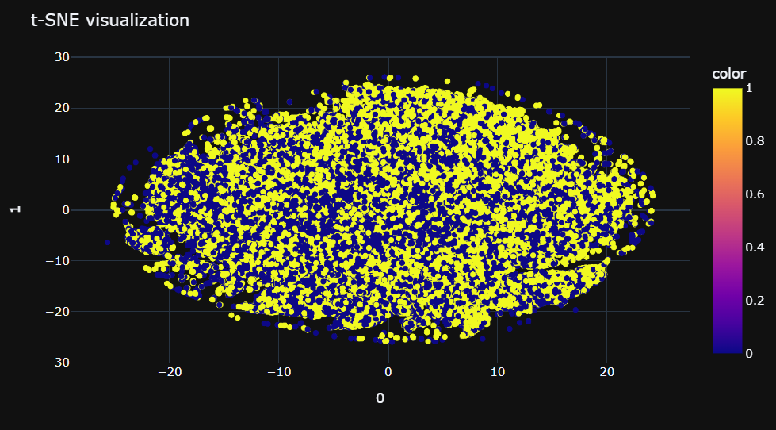

# Определение настроения твита

Работа сделана для курса "Машинное обучение для анализа научных данных" ([условия задания](task.md)).

## Задача

**Бизнес-задача:** нужно научиться определять эмоциональный окрас текста: негативный, нейтральный, позитивный.

**ML-задача:** в датасете [sentiment140](https://www.kaggle.com/datasets/kazanova/sentiment140)
1.6 миллионов твитов, каждому из которых проставлена метка класса, необходимо сделать бинарную классификацию.

## Метрики

Можно использовать классические для бинарной классификации метрики: accuracy, precision, recall, f1.
Больше ориентироваться нужно на accuracy, так как мы хотим максимизировать правильную классификацию и позитивных, и
негативных твитов. 
> Если бы мы классифицировали отзывы на продукт, то нам было бы важнее находить все отрицательные
отзывы, поэтому мы бы максимизировали recall, но в данном случае accuracy будет достаточно.

## Результаты

| Классификатор      | Accuracy | 
|--------------------|----------|
| DummyClassifier    | 0.5      |
| LogisticRegression | 0.6      |
